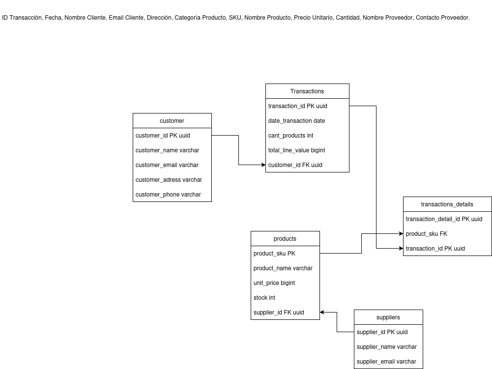

# 📦 Inventory Management REST API

A RESTful API built with **Node.js**, **Express.js**, and **PostgreSQL** for managing inventory, suppliers, customers, products, and transactions. This project demonstrates relational database design, backend architecture, SQL operations, and API development using industry-standard practices.

---

## 🚀 Project Overview

This application provides a centralized system for managing inventory operations and commercial transactions. It enables the registration of products, suppliers, customers, and sales transactions while maintaining data integrity through a relational database model.

The project was developed to strengthen backend development skills, relational database management, and API design principles.

---

## 🏗️ Architecture

```text
Client
   │
   ▼
Express REST API
   │
   ├── Routes
   ├── Controllers
   ├── Services
   │
   ▼
PostgreSQL Database
```

The application follows a layered architecture to improve maintainability, scalability, and code organization.

---

## ✨ Features

* Product management
* Customer management
* Supplier management
* Transaction registration
* Transaction details tracking
* PostgreSQL relational database integration
* RESTful API endpoints
* Modular backend architecture
* SQL-based data persistence

---

## 🗄️ Database Design

The database is designed using relational modeling principles and normalization techniques.

### Main Entities

* Customers
* Suppliers
* Products
* Transactions
* Transaction Details

### Relationships

* One customer can have multiple transactions
* One supplier can provide multiple products
* One transaction can contain multiple products
* Transaction details connect products and transactions

---

## 📊 Entity Relationship Diagram

Add your database diagram here:

```markdown

```

---

## 🛠️ Tech Stack

### Backend

* Node.js
* Express.js

### Database

* PostgreSQL

### Development Tools

* Git
* GitHub
* Visual Studio Code

---

## 📂 Project Structure

```text
inventory-management-api
│
├── src
│   ├── config
│   ├── controllers
│   ├── routes
│   ├── services
│   └── app.js
│
├── database
│   └── schema.sql
│
├── README.md
├── package.json
└── .env
```

---

## ⚙️ Installation

### Clone the repository

```bash
git clone https://github.com/yourusername/inventory-management-api.git
```

### Navigate to the project folder

```bash
cd inventory-management-api
```

### Install dependencies

```bash
npm install
```

### Configure environment variables

Create a `.env` file:

```env
DB_HOST=localhost
DB_PORT=5432
DB_NAME=inventory_db
DB_USER=postgres
DB_PASSWORD=your_password
```

### Run database schema

Execute the SQL script included in the project:

```sql
database/schema.sql
```

### Start the application

```bash
npm run dev
```

---

## 🔗 API Endpoints

### Customers

```http
GET /customers
POST /customers
PUT /customers/:id
DELETE /customers/:id
```

### Products

```http
GET /products
POST /products
PUT /products/:id
DELETE /products/:id
```

### Suppliers

```http
GET /suppliers
POST /suppliers
PUT /suppliers/:id
DELETE /suppliers/:id
```

### Transactions

```http
GET /transactions
POST /transactions
```

---

## 📚 What I Learned

Through this project I strengthened my knowledge in:

* Relational Database Design
* SQL Query Development
* PostgreSQL Administration
* REST API Development
* Backend Architecture
* CRUD Operations
* Data Modeling
* Entity Relationships
* Git & GitHub Workflow

---

## 🎯 Future Improvements

* Authentication and Authorization
* Input Validation Middleware
* API Documentation with Swagger
* Docker Containerization
* Automated Testing
* Cloud Deployment
* Logging and Monitoring

---

## 👩‍💻 Author

**Fernanda Higuita**

Aspiring Data Analyst & Data Engineer

Focused on Data Analytics, ETL Pipelines, Backend Development, and Cloud Data Platforms.
